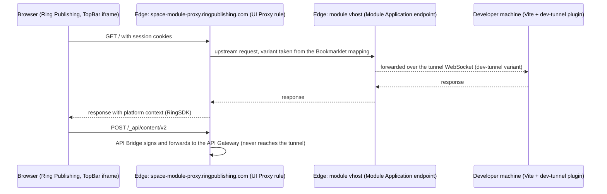

# Ring Module Local Development

> **Boundary:** This skill covers running a module application locally so that it is served by Ring Publishing. For implementing module code, use `/ring-module-development`. For registering the module and its Module Application in Management Console, use `/ring-module-configuration`.

## Documentation routing

Use this skill for the request flow, the verified setup and troubleshooting. Consult the canonical sources for details that change independently of this skill:

- **Why local development needs the platform, and the official tutorial:** [Develop a module UI on your own machine](https://developer.ringpublishing.com/howto/build-a-module/develop-locally.html) in the Ring Modules Framework developer guide.
- **Development variants and how to force one:** [Development variant](https://developer.ringpublishing.com/docs/Accelerator/topics/development/development-variant/index.html) and [Bookmarklet](https://developer.ringpublishing.com/docs/Accelerator/topics/development/bookmarklet/index.html) in the Accelerator documentation. The Accelerator panel itself is described in [Accelerator Panel](https://developer.ringpublishing.com/docs/Accelerator/overview/panel/index.html).
- **Where local development sits in the end-to-end flow:** Step 3 of [Getting started](https://developer.ringpublishing.com/getting-started/index.html).
- **Client options, CLI commands, exit codes:** the README of [`@ringpublishing/accelerator-dev-tunnel`](https://www.npmjs.com/package/@ringpublishing/accelerator-dev-tunnel).

Treat the Accelerator documentation as authoritative for panel labels and click-by-click actions.

## Why a tunnel

Outside Ring Publishing a module is broken: `RingSDK` is missing and `/_api` resolves to nothing. A dev tunnel makes Ring Accelerator use the developer machine as the upstream of a **development variant** of the module's vhost, so the module runs through the platform while the local dev server answers. Background: [Develop a module UI on your own machine](https://developer.ringpublishing.com/howto/build-a-module/develop-locally.html).

## Request flow

The module is served through UI Proxy, so the variant is selected with the Accelerator Bookmarklet mapping for the module's vhost.



Consequences that are easy to miss:

- **The vhost to tunnel is the Module Application endpoint** configured in Management Console, that is the host UI Proxy calls as the module's upstream. The `<space>-<module>.ringpublishing.com` and `-proxy` domains are served by the platform's UI Proxy and are not configured by the module author.
- **The variant is selected with the Bookmarklet.** Add or pick the module's vhost under **Mappings** and set it to the development variant (see step 4). Until then, the iframe shows whatever the in-traffic variant serves, typically a 404.
- **`/_api` requests never show up in the tunnel log.** The API Bridge answers them at the edge. A `/_api` request that does reach the dev server (and returns 404 there) means the page was not opened through Ring Publishing.
- **Opening the module vhost directly is only a smoke test.** The page arrives without `RingSDK`, so any top-level SDK call throws and `/_api` returns 404. Use the platform path for real work.

## Setup

### 1. Development variant with a dev-tunnel upstream

In the Accelerator panel of the Website space that owns the module vhost:

1. On the module vhost, create a variant with **Set as development**.
2. Set its primary upstream's **Upstream type** to **Dev tunnel** and deploy. The panel shows the JWT and ready-made client commands.

Treat the token like a password; it expires (`acc-dev-tunnel check` shows the remaining validity) and can be rotated from the panel. One machine holds a variant at a time, so use one development variant per developer. Panel details: [Development variant](https://developer.ringpublishing.com/docs/Accelerator/topics/development/development-variant/index.html).

### 2. Project wiring (Vite)

```bash
npm install --save-dev @ringpublishing/accelerator-dev-tunnel
```

Keep the three connection parameters out of version control and read them from the environment. Registering the plugin only when all of them are present keeps the dev server usable in a checkout that has no local configuration yet:

```ts
import { defineConfig, loadEnv } from 'vite';
import { vitePlugin as accDevTunnel } from '@ringpublishing/accelerator-dev-tunnel/vite';

export default defineConfig(({ mode }) => {
    const {
        ACC_DEV_TUNNEL_TOKEN: token,
        ACC_DEV_TUNNEL_VHOST: vhost,
        ACC_DEV_TUNNEL_VARIANT: variant
    } = loadEnv(mode, process.cwd(), 'ACC_DEV_TUNNEL_');
    const tunnelConfigured = Boolean(token && vhost && variant);

    return {
        plugins: [
            // ...other plugins
            ...(tunnelConfigured ? [accDevTunnel({ token, vhost, variant })] : [])
        ]
    };
});
```

`loadEnv` reads `.env*` files and the shell; the `ACC_DEV_TUNNEL_` prefix is not `VITE_`, so none of these values reach the browser bundle. Put the values in `.env.local` (gitignored) and list the keys with empty or placeholder values in a committed `.env.example`. The plugin reads the port from the running dev server and adds the vhost to `server.allowedHosts` itself; no hand-edited host list is needed.

For a non-Vite dev server use the CLI (`npx @ringpublishing/accelerator-dev-tunnel setup`, then `start`) and add the vhost to that server's host check manually. The tunnel is independent of the module's stack: it forwards to a local HTTP port, so the framework, the bundler and the language are the module's own choice. A webpack plugin and a Node.js API are documented in the package README.

### 3. Start

```bash
npm run dev
```

Expect two plugin lines after Vite's own banner:

```text
[acc-dev-tunnel] connected to <vhost>::<variant>
[acc-dev-tunnel] no traffic reaches <variant> until you force it: ...
```

### 4. Route the browser to the local module

1. Sign in to Ring Publishing and open the Space that has the module instance, then open the module from the menu. The iframe is served through the `-proxy` domain.
2. Run the Accelerator **Bookmarklet** on that page and open the **Mappings** tab. Find the module vhost in the list of upstreams; if it is not listed, add it with **+** and enter the vhost.
3. Select the development variant for that vhost and reload. The tunnel log starts showing the module's requests.
4. Confirm the SDK is there: in the browser's developer tools select the `coreIframe` frame and run `await RingSDK.api.apps.getApplications()` in the console. See [Start working with the UI framework](https://developer.ringpublishing.com/howto/build-a-module/start-with-the-sdk.html).

### 5. Verify without a browser

- Before starting the dev server, `npx acc-dev-tunnel check <vhost> <variant> --port <port>` (with `ACC_DEV_TUNNEL_TOKEN` exported) reports on the token, the local app and the Accelerator connection separately. `check` opens its own connection, so run it before `npm run dev`, not alongside it.
- With the dev server running, a request addressed to the module vhost with the header `x-oa-variant: <vhost>::<variant>` is answered by the dev server and logged by the plugin. This confirms the tunnel, not the platform integration.

## Troubleshooting

| Symptom | Cause | Fix |
|---|---|---|
| Module iframe shows 404 or production content while the tunnel log stays quiet | The module's vhost is not mapped to the development variant | Set the mapping in the Bookmarklet's **Mappings** tab (step 4) |
| `403 Blocked request` in the tunnel log | Vite rejects the vhost as `Host` | Let the plugin add `server.allowedHosts`; with the CLI, add the vhost manually |
| 502 in the browser, tunnel connected | Nothing listens on the forwarded port | Start the dev server, or pass `port` to the plugin |
| `token_expired` / `token_mismatch` | Token expired, or rotated in the panel | Copy the current token from the panel into `.env.local` |
| Plugin exits reporting a takeover | Another client connected to the same variant | Use separate variants per developer |
| `ReferenceError: RingSDK is not defined` | Page opened on the raw vhost or `localhost`, not through Ring Publishing | Open the module from Ring Publishing with the mapping set |
| `POST /_api/... → 404` in the tunnel log | Page opened outside Ring Publishing, so the API Bridge never saw the request | Open the module from Ring Publishing |

Client-side symptoms not listed here (TLS errors, webpack host check, middleware mode) are covered in the Troubleshooting section of the [package README](https://www.npmjs.com/package/@ringpublishing/accelerator-dev-tunnel).

> **Example repository note:** The Vite wiring shown here is one way to hold the configuration, taken from this example module. The variant setup, the Bookmarklet mapping and the failure modes apply to any module regardless of its stack.

## Further reading

- [`@ringpublishing/accelerator-dev-tunnel` on npm](https://www.npmjs.com/package/@ringpublishing/accelerator-dev-tunnel)
- [Accelerator documentation: Development](https://developer.ringpublishing.com/docs/Accelerator/topics/development/index.html)
